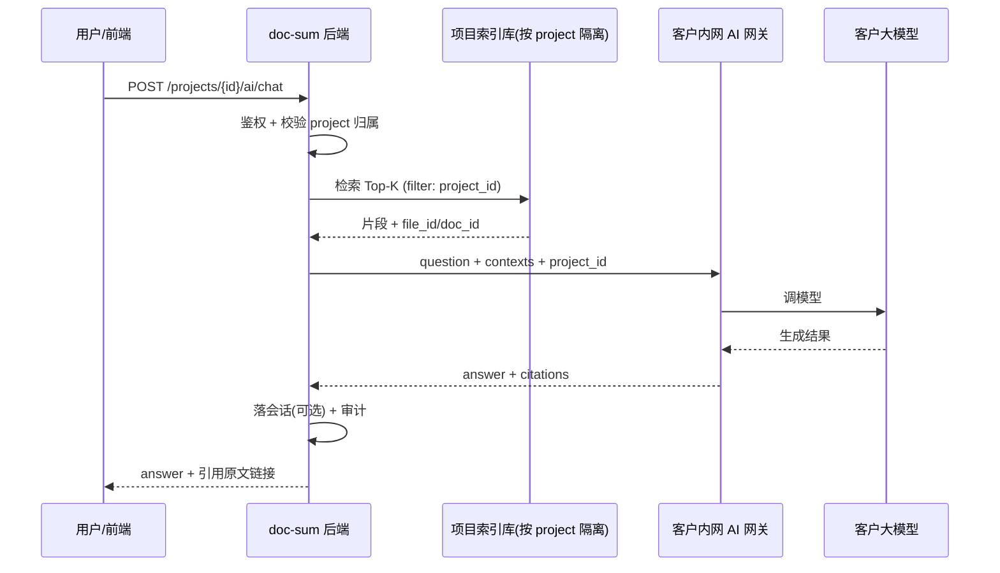

# AI 问答 · 客户内网网关 + 项目隔离 · 后端设计

> **日期**：2026-09-02  
> **范围**：`xiangmu/DocumentSummarization` 后端对接设计（前端 AI 问答、文件映射、文档详情联动）  
> **方案**：**B — 客户内网 AI 网关**（平台不持有客户 LLM API Key）  
> **状态**：设计稿，待评审

---

## 1. 背景与目标

### 1.1 业务诉求

1. **项目文件可被 AI 读取**：用户选定项目后，问答能基于该项目内的文档/修改记录回答。
2. **AI 问答可用**：前端 `AIQuestionAnswer.vue` 从 mock 切换为真实接口；回答附带原文引用。
3. **项目间严格隔离**：项目 A 的索引、检索结果、会话不得进入项目 B。
4. **降低信息泄露风险**：尽量使用**客户自己的 API / 内网网关**调用大模型，平台不统一代持客户 LLM Key。

### 1.2 方案选型（已确认：方案 B）

| 方案 | 说明 | 结论 |
|------|------|------|
| A | 平台统一 LLM Key，文档经平台调模型 | 实现快，泄密与合规风险高 |
| **B** | **平台做检索与编排，仅 POST「问题 + 片段」至客户内网网关** | **已选** |
| C | 检索 + 生成均在客户侧 | 隔离最强，客户对接成本最高 |

### 1.3 成功标准

- [ ] 用户只能在有权限的项目内发起问答
- [ ] 每次问答检索结果 100% 限定于当前 `project_id`
- [ ] 平台不存储客户 LLM API Key
- [ ] 客户网关仅收到 Top-K 片段，不收全库文件
- [ ] 前端可展示 answer + citations，并可跳转至文件/修改记录详情页

---

## 2. 职责边界

| doc-sum 平台（我方后端） | 客户内网 AI 网关（客户 IT） |
|--------------------------|----------------------------|
| 用户 / 项目 / 权限 | 持有并调用大模型 Key |
| Git / 文档接入、切片、索引 | 接收「问题 + 检索片段」 |
| 按 `project_id` 检索（硬隔离） | 组装 Prompt、调 LLM |
| 会话管理、引用溯源、审计 | 返回答案（可选 citations） |
| 将最小上下文 POST 至客户网关 | **不**向平台索要全库文档 |

**核心原则：**

- 平台是**编排层 + 检索层**，不是「代客调 OpenAI」的中转站。
- 文档进入 AI 的路径：`仓库/上传 → 解析切片 → 写入项目隔离索引 → 问答检索 → 片段交给客户网关`，**不是**整库塞进 Prompt。

---

## 3. 总体架构



---

## 4. 项目隔离（硬约束）

### 4.1 隔离维度

所有知识库相关数据必须携带：

```text
tenant_id      # 客户组织（多租户）
project_id     # 项目（隔离单元）
```

### 4.2 核心数据表（建议）

```text
projects
  id, tenant_id, name, repo_url, branch, gateway_config_id, status

project_members
  project_id, user_id, role

project_gateway_configs
  id, tenant_id
  gateway_url          # 客户内网 webhook
  auth_type            # mTLS | hmac | bearer
  auth_secret_enc      # 加密存储（HMAC secret 或 outbound token，非 LLM key）
  timeout_ms           # 默认 30000
  enabled

document_chunks
  id, tenant_id, project_id
  file_id, doc_id, path, module
  chunk_index, content, content_hash
  commit_sha, indexed_at

chat_sessions
  id, tenant_id, project_id, user_id, title, created_at

chat_messages
  id, session_id, role, content, citations_json, created_at

index_jobs
  id, project_id, status, started_at, finished_at, error
```

### 4.3 隔离规则

1. **检索**：向量 / SQL 查询必须带 `WHERE project_id = ? AND tenant_id = ?`。
2. **API**：路径使用 `/projects/{projectId}/...`；服务端根据登录用户校验 membership，**禁止**仅信任 body 中的 projectId。
3. **缓存**：Redis key 前缀 `tenant:{tid}:project:{pid}:`。
4. **对象存储**：路径 `/{tenant_id}/{project_id}/...`。
5. **网关请求**：payload 携带 `project_id`；客户网关应校验与约定项目映射一致。
6. **会话**：`chat_session` 绑定 `project_id`；换项目必须新会话，禁止跨项目续聊。

---

## 5. 平台 API（对前端）

Base path 建议：`/api`（与现有 `VITE_API_BASE_URL` 一致）。

### 5.1 项目网关配置（管理员）

```http
PUT /api/tenants/{tenantId}/projects/{projectId}/gateway
```

请求体：

```json
{
  "gatewayUrl": "https://ai-gateway.customer.internal/v1/doc-sum/chat",
  "authType": "hmac",
  "authSecret": "客户提供的出站密钥（仅首次提交，之后不回显）",
  "timeoutMs": 30000
}
```

```http
GET /api/tenants/{tenantId}/projects/{projectId}/gateway
```

响应（不回显 secret）：

```json
{
  "gatewayUrl": "https://ai-gateway.customer.internal/v1/doc-sum/chat",
  "authType": "hmac",
  "enabled": true,
  "lastHealthCheckAt": "2026-09-02T10:00:00Z",
  "lastHealthCheckOk": true
}
```

### 5.2 索引任务

```http
POST /api/projects/{projectId}/index-jobs
GET  /api/projects/{projectId}/index-jobs/{jobId}
```

索引来源：与前端「文件映射」对齐，从 Git webhook 或定时拉取 mapped 文件 + 修改记录正文（`.md`）。

### 5.3 AI 问答（核心）

```http
POST /api/projects/{projectId}/ai/chat
Authorization: Bearer <用户 JWT>
```

请求：

```json
{
  "sessionId": "可选，续聊",
  "question": "最近合同模块改了什么？",
  "options": {
    "topK": 8,
    "includeHistory": true
  }
}
```

响应：

```json
{
  "sessionId": "sess_xxx",
  "answer": "……",
  "citations": [
    {
      "fileId": "f1",
      "docId": "REC-001",
      "path": "src/views/contract/List.vue",
      "title": "修复合同列表 customerId 筛选",
      "snippet": "优先读取路由 query.customerId …",
      "score": 0.89
    }
  ],
  "meta": {
    "projectId": "rd-xmz",
    "gatewayLatencyMs": 1200,
    "retrievalCount": 8
  }
}
```

### 5.4 会话历史

```http
GET /api/projects/{projectId}/ai/sessions
GET /api/projects/{projectId}/ai/sessions/{sessionId}/messages
```

---

## 6. 客户内网网关契约（客户 IT 实现）

平台定义标准协议；客户在贵司内网部署 Gateway，按协议接收请求并调内网 LLM。

### 6.1 请求（平台 → 客户网关）

```http
POST {gatewayUrl}
Content-Type: application/json
X-DocSum-Timestamp: 1735689600
X-DocSum-Signature: HMAC-SHA256(...)
X-DocSum-Request-Id: uuid
```

Body：

```json
{
  "protocolVersion": "1.0",
  "requestId": "uuid",
  "tenantId": "t1",
  "projectId": "rd-xmz",
  "sessionId": "sess_xxx",
  "user": {
    "id": "u123",
    "displayName": "demo-user"
  },
  "question": "最近合同模块改了什么？",
  "contexts": [
    {
      "fileId": "f1",
      "docId": "REC-001",
      "path": "src/views/contract/List.vue",
      "module": "合同模块",
      "title": "修复合同列表 customerId 筛选",
      "snippet": "优先读取路由 query.customerId …",
      "score": 0.89,
      "sourceType": "change_doc"
    }
  ],
  "history": [
    { "role": "user", "content": "上一轮问题" },
    { "role": "assistant", "content": "上一轮回答" }
  ],
  "constraints": {
    "answerLanguage": "zh-CN",
    "mustCiteSources": true,
    "maxTokens": 2048
  }
}
```

**安全约定：**

- `contexts` 仅包含 Top-K 片段，**禁止**发送全文件或全库。
- 客户网关应校验 `projectId` 与双方约定的项目映射一致。
- 建议 **mTLS** 或 **IP 白名单 + HMAC** 双保险。
- 客户网关不应将 `contexts` 再转发至未经批准的公网第三方。

### 6.2 响应（客户网关 → 平台）

成功：

```json
{
  "requestId": "uuid",
  "answer": "最近合同模块主要改了……",
  "citations": [
    { "fileId": "f1", "docId": "REC-001", "quote": "优先读取路由 query.customerId" }
  ],
  "usage": {
    "promptTokens": 1800,
    "completionTokens": 320
  }
}
```

失败：

```json
{
  "requestId": "uuid",
  "error": {
    "code": "MODEL_TIMEOUT",
    "message": "模型调用超时"
  }
}
```

平台将网关错误映射为 HTTP 502/504 返回前端，并写入审计日志。

### 6.3 健康检查（可选）

```http
GET {gatewayBaseUrl}/health
```

或平台定期对 `gatewayUrl` 发送 ping 请求，结果写入 `lastHealthCheckAt` / `lastHealthCheckOk`。

### 6.4 客户网关最小实现步骤

1. 校验签名 / mTLS。
2. 校验 `projectId`。
3. 用固定 Prompt 模板将 `question + contexts` 拼成 messages。
4. 调用内网 LLM（vLLM / 通义私有化 / Azure 私有部署等）并返回 JSON。

客户**不需要**实现检索，**不需要**对接平台 Git。

---

## 7. 索引与检索

### 7.1 与前端数据模型对齐

| 索引单元 | 来源（前端 mock 字段） | 用途 |
|----------|------------------------|------|
| 文件级摘要 | `MappedFile.aiBrief` | 粗检索 |
| 修改记录 | `ChangeDoc.summary` / `aiBrief` / 正文 md | 精检索 |
| 客户注释 | `ClientComment.content` | 可选纳入 |

### 7.2 切片建议

- 每 chunk 500–800 中文字符，overlap 80–120。
- metadata 必含：`project_id`, `file_id`, `doc_id`, `path`, `commit_sha`。
- 向量库：每 tenant 独立 DB，或单库 + `project_id` 强制过滤 + collection 名 `p_{project_id}`。

### 7.3 Embedding 子方案

| 子方案 | 说明 | 推荐 |
|--------|------|------|
| **B-1** | 平台本地 embedding 模型（如 bge）或客户提供的 **embedding 网关**（仍无 LLM Key） | **默认** |
| B-2 | 客户网关同时提供 `/embed`；chunk 明文不出客户域，平台只存向量 + id | 高安全客户 |

若客户要求「文档内容完全不出域」，采用 **B-2**：索引任务将 chunk POST 至客户 embedding 网关，取回向量后存储（仅存向量与 id，不存明文）。

---

## 8. 与前端页面对接

| 前端页面 / 能力 | 后端接口 |
|-----------------|----------|
| `AIQuestionAnswer.vue` 选项目 | `GET /projects` + `POST /projects/{id}/ai/chat` |
| 回答带引用跳转 | `citations[].fileId` / `docId` → `/app/projects/:id/files/:fileId` |
| `ProjectFileDetail.vue` AI 简介 | 异步 `POST .../ai/summarize`（单 doc 片段，同网关协议） |
| 新项目可问答 | 索引 job 完成 + gateway health check 通过 |

前端改造：将 mock `send()` 替换为调用 `POST /projects/{projectId}/ai/chat`（可选 SSE 流式，Phase 2+）。

---

## 9. 安全与合规清单

- [ ] 平台**不存储**客户 LLM API Key
- [ ] 网关 outbound 密钥加密存储，接口不回显明文
- [ ] 每次 chat 检索结果 `project_id` 100% 匹配
- [ ] 集成测试：项目 A 文档永不出现在项目 B 的 `contexts`
- [ ] 网关超时、熔断；chat 请求不做盲目重试（防重复计费）
- [ ] 审计日志：记录 user、project、question、requestId；**可不存 answer 全文**（仅存 hash + citation ids）
- [ ] 客户网关 health check 与告警

---

## 10. 实施分期

### Phase 1 — 能问答

1. `project_gateway_configs` + 配置 API
2. 简易关键词 / BM25 检索（可先不上向量）
3. `POST /projects/{id}/ai/chat` → 调客户网关（或 mock gateway）
4. 项目隔离单元测试

### Phase 2 — 能读文件

1. Git 接入 + `document_chunks`
2. 向量检索 Top-K
3. citations 溯源至 file / doc

### Phase 3 — 生产级

1. mTLS / HMAC 完整实现
2. 异步索引 job + webhook
3. 会话历史、摘要任务、网关健康检查与监控

---

## 11. 给客户 IT 的一页说明（可转发）

> 请在贵司内网部署 **doc-sum AI Gateway**，暴露 HTTPS 地址并完成与平台的 mTLS/HMAC 对接。  
> 我方平台在用户提问时，仅 POST：**用户问题 + 与本项目相关的文档片段（Top 8）+ project_id**。  
> 请贵司网关调用内网大模型生成回答并以 JSON 返回。  
> 我方**不持有**贵司模型 API Key，**不传输**全库文件。  
> 请实现签名校验，并确保 `projectId` 与贵司项目映射一致。

---

## 12. 相关文档

- 前端框架说明（对话输出，可另存为 `docs/frontend-framework.md`）
- `docs/superpowers/specs/2026-09-01-file-map-and-detail.md` — 文件映射与文档详情
- `docs/superpowers/specs/2026-09-01-f0-framework-scaffold-design.md` — F0 骨架
- 前端页面：`src/views/AIQuestionAnswer/AIQuestionAnswer.vue`
- 数据模型：`src/utils/fileMap.ts`、`src/stores/fileMap.mock.ts`

---

## 13. 待评审项

1. Embedding 默认采用 B-1 还是部分客户强制 B-2？
2. 问答是否 Phase 1 即支持 SSE 流式，还是首版仅同步 JSON？
3. 审计日志保留策略（question 明文 / 仅 hash / 保留天数）？
4. 客户网关 `protocolVersion` 升级策略与向后兼容窗口？
